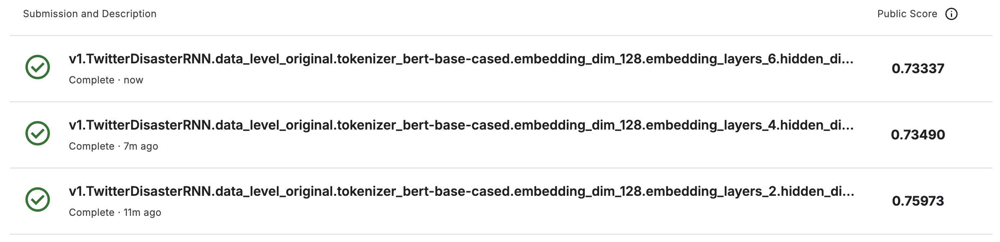

# DTSA 5511 Introduction to Machine Learning: Deep Learning
Andrew Simms
2024-12-01

This project develops a PyTorch (Ansel et al. 2024) based Recurrent
Neural Network (RNN) to classify disaster-related tweets as part of the
Natural Language Processing with Disaster Tweets Kaggle competition
(Howard et al. 2019), utilizing a labeled dataset of 10,000 tweets for
binary classification and submitting the model’s predictions for
evaluation.

The full report can be viewed
[here](http://www.andrewdsimms.com/nlp_disaster_tweets/).

# Model Code

RNN models are in `./week_4.py`

# Running Models

    ./nlp_batch.sh

# Kaggle Scores

Figure 1: Kaggle Scores

# References

Ansel, Jason, Edward Yang, Horace He, Natalia Gimelshein, Animesh Jain,
Michael Voznesensky, Bin Bao, et al. 2024. “PyTorch
2: Faster Machine Learning Through Dynamic Python Bytecode
Transformation and Graph Compilation.” In *29th ACM International
Conference on Architectural Support for Programming Languages and
Operating Systems, Volume 2 (ASPLOS ’24)*. ACM.
<https://doi.org/10.1145/3620665.3640366>.

Howard, Addison, devrishi, Phil Culliton, and Yufeng Guo. 2019. “Natural
Language Processing with Disaster Tweets.”
<https://kaggle.com/competitions/nlp-getting-started>.

