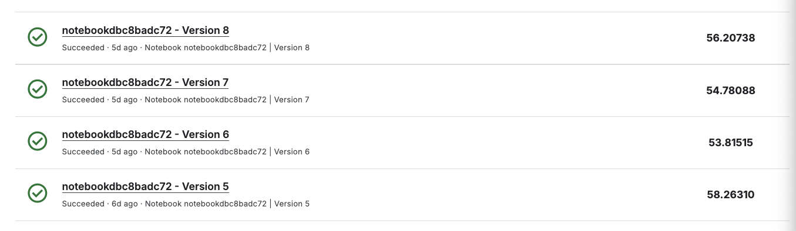

# DTSA 5511 Introduction to Machine Learning: Deep Learning
Andrew Simms
2024-12-07

# Overview

This project implements a Generative Adversarial Network (GAN) to
transform photographs into artworks in the style of Claude Monet. It was
developed as a submission for the Kaggle competition “I’m Something of a
Painter Myself.”

The full report can be viewed
[here](http://www.andrewdsimms.com/using_gans_to_create_art/).

# Model Code

GAN models and training are in `./week_5.py`

Report source code is in `./quarto/index.qmd`. Rendered documents
`./week_5_report.ipynb` (image rendering is not working),
`./week_5_report.pdf` (image rendering works) and the final output can
be viewed [here](http://www.andrewdsimms.com/using_gans_to_create_art/).

# Running Models

    python week_5

# Kaggle Scores

Figure 1: Kaggle Scores

